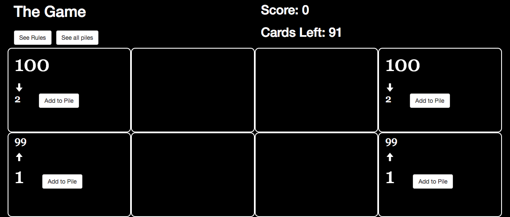

# the_game_game
One-player version of The Game card game created with Javascript and jQuery. 

Try to play as many cards as you can onto four piles. The deck has 98 cards, one for each number between 2 and 99. You start by drawing 7 cards into your hand. Each turn, you must play at least 2 cards from your hand before drawing back to 7. Two piles go in ascending order from 1 to 99. Two piles go in descending order from 100 to 2. The game ends if you can no longer make a legal play from the cards in your hand.

Good luck!

Play the game [here](http://the-game-game.surge.sh/game.html)

Created by [David Jiang](https://github.com/davidmjiang)

